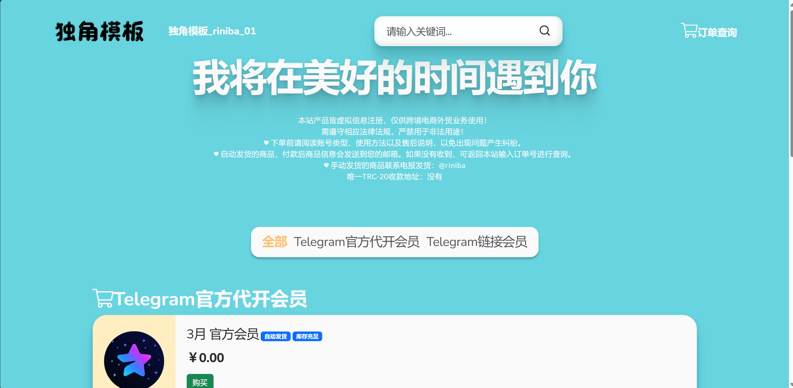
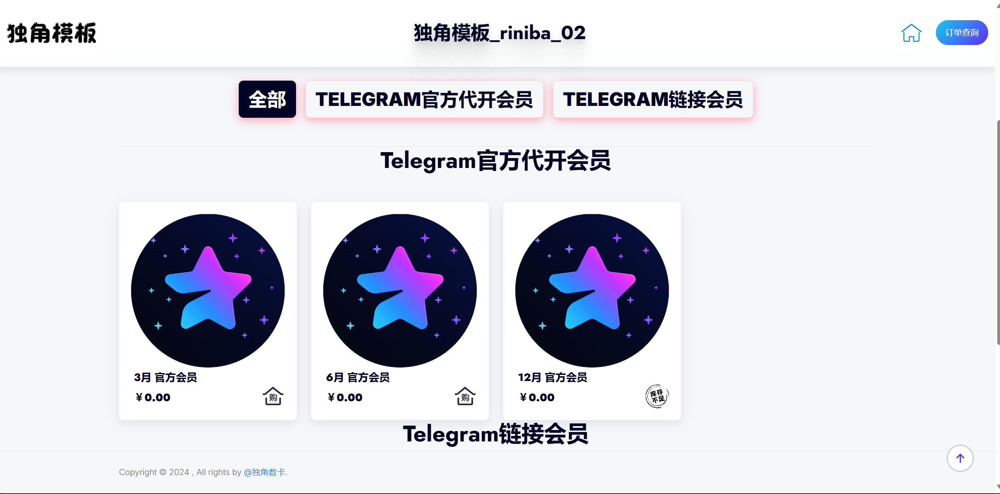

# 独角卡模板合集

本项目提供了若干个精美的独角卡程序前端模板，分别存放于 `riniba_编号`  文件夹中。您可以根据自己的需求选择合适的模板，并在独角卡程序中快速应用。

## AD -- 机场推广

机场 - 老百姓自己的机场：[https://老百姓自己的机场.com](https://老百姓自己的机场.com)

> 咱老百姓就得用自己的机场
> 老百姓自己的机场 做用的起的机场

## 演示地址

- **模板1演示站点**：  
  [https://demo1.riniba.net/](https://demo1.riniba.net/)

- **模板2演示站点**：  
  [https://demo2.riniba.net/](https://demo2.riniba.net/)

## 使用方法

1. 根据您的需求选择对应的模板文件夹（例如 `riniba_01`）。
2. 下载该模板文件夹，并将其中的所有文件覆盖到独角卡程序的根目录下。
3. 登录独角卡后台，在后台选择对应的主题进行切换，即可完成应用新模板。

> **注意**：本模板只支持独角卡的 **原版程序**，请确保您的程序版本为官方原版。

## 模板预览

在项目的 `image` 文件夹中提供了若干张示例图片，用于展示模板的页面布局与风格外观。

- 

您可以直接在 GitHub 浏览器中打开图片预览，或在本地查看：

更多示例图可在 `image` 文件夹中查看。

## 特点

- 简洁易用的前端界面设计，让您的独角卡商城更具吸引力。
- 易于定制的结构和样式，满足个性化需求。
- 与独角卡原版程序完美适配，无需额外插件或复杂配置。

## 支持与反馈

如果在使用过程中遇到问题或有建议，欢迎通过 Issue 功能进行反馈。我们会尽快协助解决。